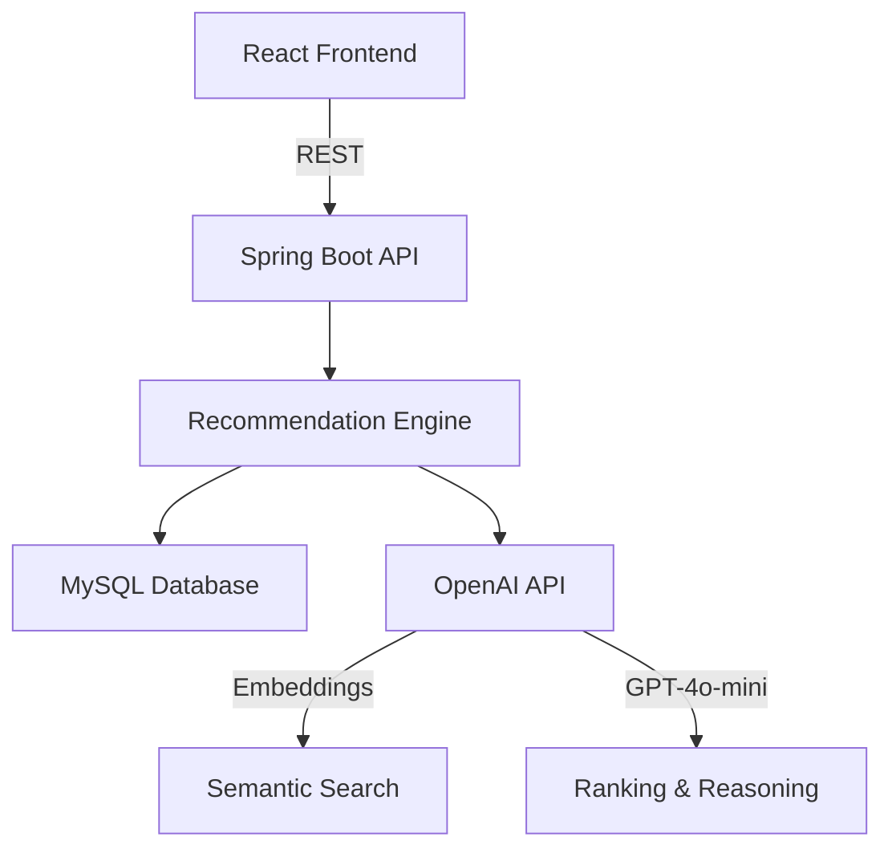

# System Architecture

## Overview
The Project Idea Recommender System is built using a clean architecture approach, specifically the Hexagonal Architecture pattern. This ensures that the core business logic is isolated from external dependencies like the database and AI services.

## Pipeline Flow
1. **Student Profile Input**: User provides skills, goals, and experience level via the React frontend.
2. **Rule-Based Filtering**: The backend filters the project database (50+ curated projects) based on difficulty and basic compatibility.
3. **Semantic Matching**: Uses OpenAI's `text-embedding-3-small` to calculate cosine similarity between the user's career goals and project descriptions.
4. **Hybrid Scoring**:
   - 40% Weight: Skill match (Jaccard similarity).
   - 30% Weight: Semantic similarity (Cosine).
   - 30% Weight: LLM evaluation (GPT-4o-mini).
5. **LLM Reasoning**: GPT-4o-mini analyzes the top candidates to generate human-readable explanations and identify skill gaps.
6. **Delivery**: Results are returned as a structured JSON response and rendered with premium UI components.

## Component Diagram

## Key Services
- `RecommendationServiceImpl`: Orchestrates the pipeline.
- `OpenAIAdapter`: Handles LLM interactions.
- `EmbeddingAdapter`: Manages vector generation.
- `HybridScoringService`: Calculates weighted scores.
